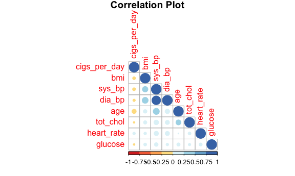
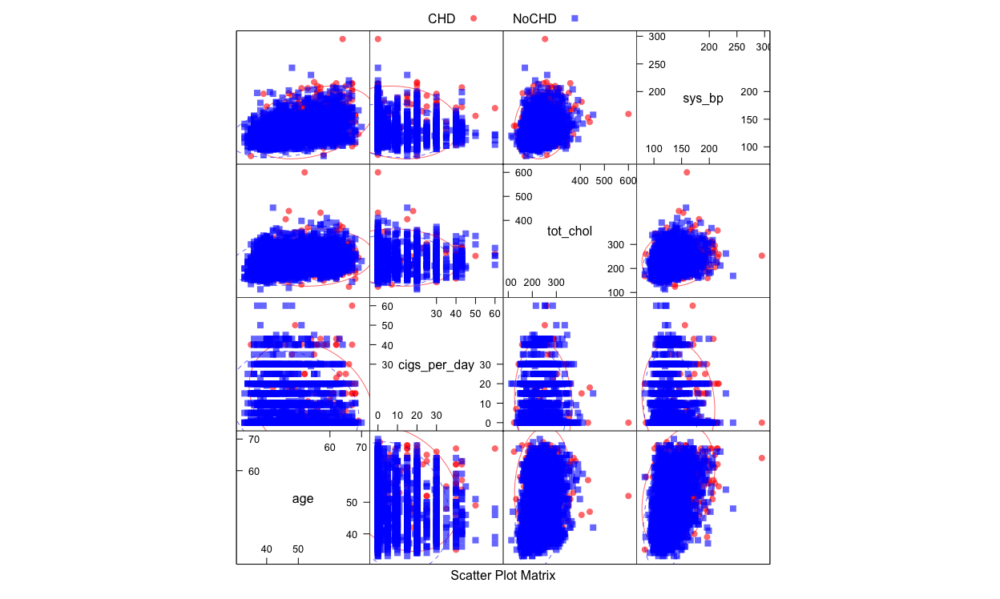
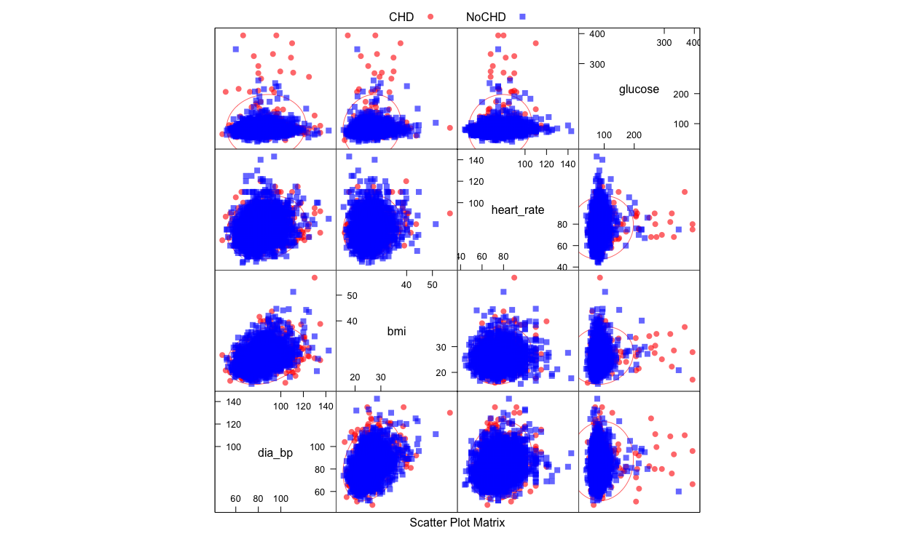
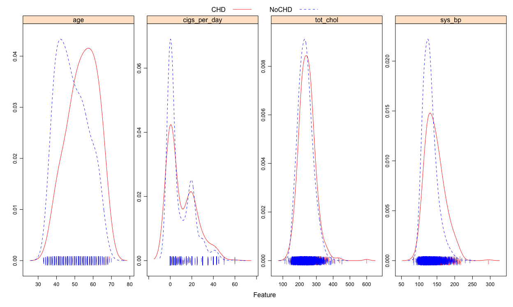
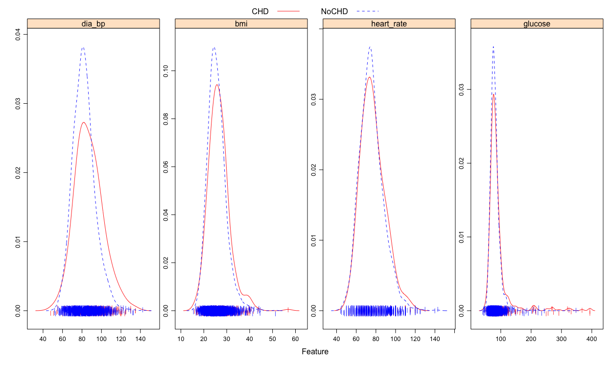
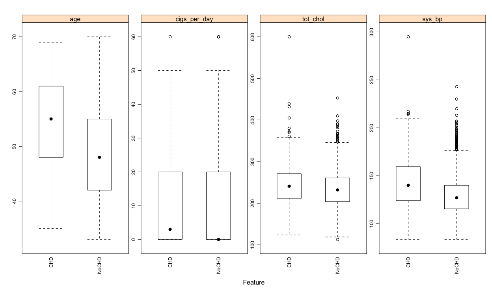
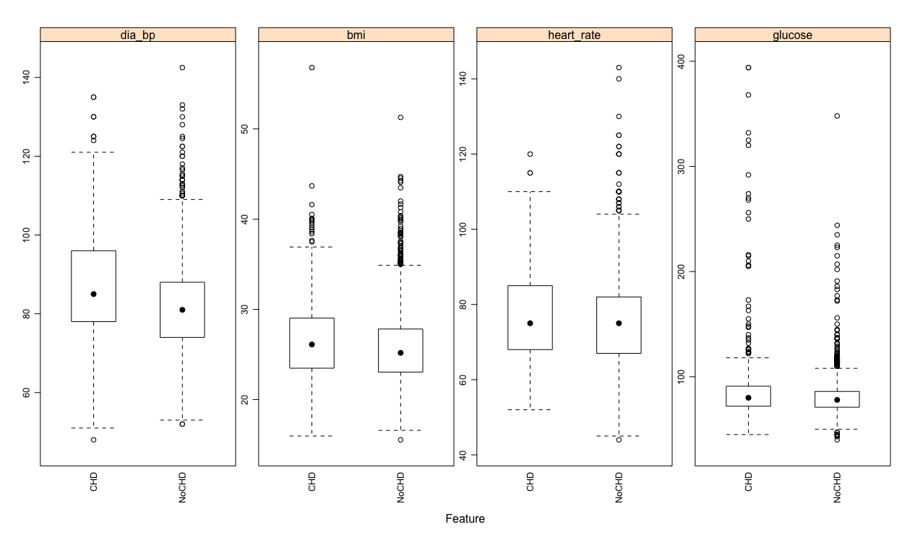
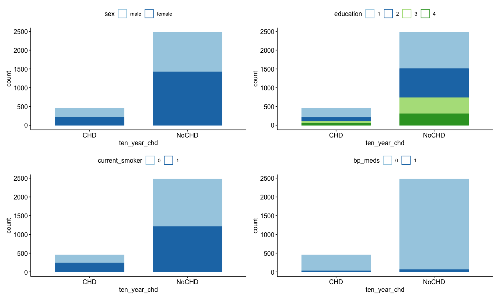
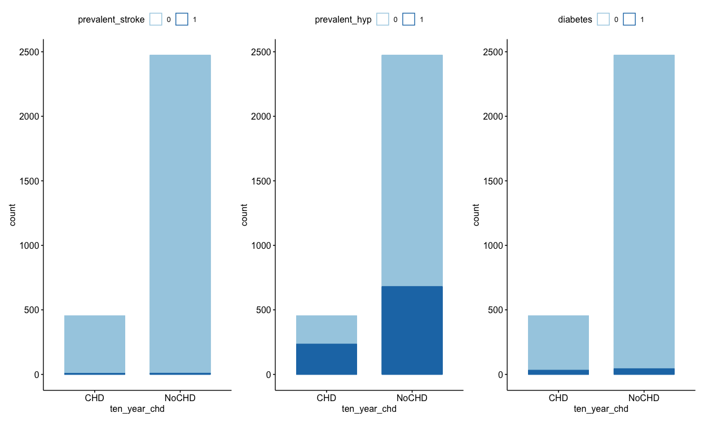

Machine learning project
================
Hun Lee, Tucker Morgan, Zachary Katz
3/15/2022

Note that for binary variable, 1: yes & 0: No

sex : the gender of the observations. The variable is a binary named
“male” in the dataset.

age : Age at the time of medical examination in years.

education : A categorical variable of the participants education, with
the levels: Some high school (1), high school/GED (2), some
college/vocational school (3), college (4)

currentSmoker: Current cigarette smoking at the time of examinations

cigsPerDay: Number of cigarettes smoked each day

BPmeds: Use of Anti-hypertensive medication at exam

prevalentStroke: Prevalent Stroke (0 = free of disease)

prevalentHyp: Prevalent Hypertensive. Subject was defined as
hypertensive if treated

diabetes: Diabetic according to criteria of first exam treated

totChol: Total cholesterol (mg/dL)

sysBP: Systolic Blood Pressure (mmHg)

diaBP: Diastolic blood pressure (mmHg)

BMI: Body Mass Index, weight (kg)/height (m)^2

heartRate: Heart rate (beats/minute)

glucose: Blood glucose level (mg/dL)

And finally the response variable : + TenYearCHD : The 10 year risk of
coronary heart disease(CHD).

## Importing and partitioning data

``` r
x <- getURL("https://raw.githubusercontent.com/TarekDib03/Analytics/master/Week3%20-%20Logistic%20Regression/Data/framingham.csv")

data <- read.csv(text = x) %>% janitor::clean_names()

data <- distinct(data) # in case there are duplicated rows

set.seed(1)
split <- initial_split(data, prop = 0.8)

training_df <- 
  split %>% 
  training() %>%
  na.omit() %>%
  mutate(male = factor(male),
         education = factor(education),
         current_smoker = factor(current_smoker),
         bp_meds = factor(bp_meds),
         prevalent_stroke = factor(prevalent_stroke),
         prevalent_hyp = factor(prevalent_hyp),
         diabetes = factor(diabetes))  %>%
  mutate(ten_year_chd = ifelse(ten_year_chd == "1", "CHD","NoCHD") %>%
           fct_relevel("CHD", "NoCHD")) %>%
  rename(sex = male) %>%
  mutate(sex = ifelse(sex == "1", "male","female") %>%
           fct_relevel("male", "female"))

testing_df <- 
  split %>% testing()  %>%
  na.omit() %>%
  mutate(male = factor(male),
         education = factor(education),
         current_smoker = factor(current_smoker),
         bp_meds = factor(bp_meds),
         prevalent_stroke = factor(prevalent_stroke),
         prevalent_hyp = factor(prevalent_hyp),
         diabetes = factor(diabetes)) %>%
  mutate(ten_year_chd = ifelse(ten_year_chd == "1", "CHD","NoCHD") %>%
           fct_relevel("CHD", "NoCHD")) %>%
  rename(sex = male) %>%
  mutate(sex = ifelse(sex == "1", "male","female") %>%
           fct_relevel("male", "female"))
```

## Data summary

``` r
skim(training_df) 
```

<table style="width: auto;" class="table table-condensed">
<caption>
Data summary
</caption>
<thead>
<tr>
<th style="text-align:left;">
</th>
<th style="text-align:left;">
</th>
</tr>
</thead>
<tbody>
<tr>
<td style="text-align:left;">
Name
</td>
<td style="text-align:left;">
training\_df
</td>
</tr>
<tr>
<td style="text-align:left;">
Number of rows
</td>
<td style="text-align:left;">
2928
</td>
</tr>
<tr>
<td style="text-align:left;">
Number of columns
</td>
<td style="text-align:left;">
16
</td>
</tr>
<tr>
<td style="text-align:left;">
\_\_\_\_\_\_\_\_\_\_\_\_\_\_\_\_\_\_\_\_\_\_\_
</td>
<td style="text-align:left;">
</td>
</tr>
<tr>
<td style="text-align:left;">
Column type frequency:
</td>
<td style="text-align:left;">
</td>
</tr>
<tr>
<td style="text-align:left;">
factor
</td>
<td style="text-align:left;">
8
</td>
</tr>
<tr>
<td style="text-align:left;">
numeric
</td>
<td style="text-align:left;">
8
</td>
</tr>
<tr>
<td style="text-align:left;">
\_\_\_\_\_\_\_\_\_\_\_\_\_\_\_\_\_\_\_\_\_\_\_\_
</td>
<td style="text-align:left;">
</td>
</tr>
<tr>
<td style="text-align:left;">
Group variables
</td>
<td style="text-align:left;">
None
</td>
</tr>
</tbody>
</table>

**Variable type: factor**

<table>
<thead>
<tr>
<th style="text-align:left;">
skim\_variable
</th>
<th style="text-align:right;">
n\_missing
</th>
<th style="text-align:right;">
complete\_rate
</th>
<th style="text-align:left;">
ordered
</th>
<th style="text-align:right;">
n\_unique
</th>
<th style="text-align:left;">
top\_counts
</th>
</tr>
</thead>
<tbody>
<tr>
<td style="text-align:left;">
sex
</td>
<td style="text-align:right;">
0
</td>
<td style="text-align:right;">
1
</td>
<td style="text-align:left;">
FALSE
</td>
<td style="text-align:right;">
2
</td>
<td style="text-align:left;">
fem: 1619, mal: 1309
</td>
</tr>
<tr>
<td style="text-align:left;">
education
</td>
<td style="text-align:right;">
0
</td>
<td style="text-align:right;">
1
</td>
<td style="text-align:left;">
FALSE
</td>
<td style="text-align:right;">
4
</td>
<td style="text-align:left;">
1: 1211, 2: 873, 3: 489, 4: 355
</td>
</tr>
<tr>
<td style="text-align:left;">
current\_smoker
</td>
<td style="text-align:right;">
0
</td>
<td style="text-align:right;">
1
</td>
<td style="text-align:left;">
FALSE
</td>
<td style="text-align:right;">
2
</td>
<td style="text-align:left;">
0: 1488, 1: 1440
</td>
</tr>
<tr>
<td style="text-align:left;">
bp\_meds
</td>
<td style="text-align:right;">
0
</td>
<td style="text-align:right;">
1
</td>
<td style="text-align:left;">
FALSE
</td>
<td style="text-align:right;">
2
</td>
<td style="text-align:left;">
0: 2839, 1: 89
</td>
</tr>
<tr>
<td style="text-align:left;">
prevalent\_stroke
</td>
<td style="text-align:right;">
0
</td>
<td style="text-align:right;">
1
</td>
<td style="text-align:left;">
FALSE
</td>
<td style="text-align:right;">
2
</td>
<td style="text-align:left;">
0: 2911, 1: 17
</td>
</tr>
<tr>
<td style="text-align:left;">
prevalent\_hyp
</td>
<td style="text-align:right;">
0
</td>
<td style="text-align:right;">
1
</td>
<td style="text-align:left;">
FALSE
</td>
<td style="text-align:right;">
2
</td>
<td style="text-align:left;">
0: 2014, 1: 914
</td>
</tr>
<tr>
<td style="text-align:left;">
diabetes
</td>
<td style="text-align:right;">
0
</td>
<td style="text-align:right;">
1
</td>
<td style="text-align:left;">
FALSE
</td>
<td style="text-align:right;">
2
</td>
<td style="text-align:left;">
0: 2852, 1: 76
</td>
</tr>
<tr>
<td style="text-align:left;">
ten\_year\_chd
</td>
<td style="text-align:right;">
0
</td>
<td style="text-align:right;">
1
</td>
<td style="text-align:left;">
FALSE
</td>
<td style="text-align:right;">
2
</td>
<td style="text-align:left;">
NoC: 2474, CHD: 454
</td>
</tr>
</tbody>
</table>

**Variable type: numeric**

<table>
<thead>
<tr>
<th style="text-align:left;">
skim\_variable
</th>
<th style="text-align:right;">
n\_missing
</th>
<th style="text-align:right;">
complete\_rate
</th>
<th style="text-align:right;">
mean
</th>
<th style="text-align:right;">
sd
</th>
<th style="text-align:right;">
p0
</th>
<th style="text-align:right;">
p25
</th>
<th style="text-align:right;">
p50
</th>
<th style="text-align:right;">
p75
</th>
<th style="text-align:right;">
p100
</th>
<th style="text-align:left;">
hist
</th>
</tr>
</thead>
<tbody>
<tr>
<td style="text-align:left;">
age
</td>
<td style="text-align:right;">
0
</td>
<td style="text-align:right;">
1
</td>
<td style="text-align:right;">
49.52
</td>
<td style="text-align:right;">
8.54
</td>
<td style="text-align:right;">
33.00
</td>
<td style="text-align:right;">
42.00
</td>
<td style="text-align:right;">
49.00
</td>
<td style="text-align:right;">
56.00
</td>
<td style="text-align:right;">
70.0
</td>
<td style="text-align:left;">
▅▇▇▆▂
</td>
</tr>
<tr>
<td style="text-align:left;">
cigs\_per\_day
</td>
<td style="text-align:right;">
0
</td>
<td style="text-align:right;">
1
</td>
<td style="text-align:right;">
8.97
</td>
<td style="text-align:right;">
11.70
</td>
<td style="text-align:right;">
0.00
</td>
<td style="text-align:right;">
0.00
</td>
<td style="text-align:right;">
0.00
</td>
<td style="text-align:right;">
20.00
</td>
<td style="text-align:right;">
60.0
</td>
<td style="text-align:left;">
▇▃▁▁▁
</td>
</tr>
<tr>
<td style="text-align:left;">
tot\_chol
</td>
<td style="text-align:right;">
0
</td>
<td style="text-align:right;">
1
</td>
<td style="text-align:right;">
236.58
</td>
<td style="text-align:right;">
44.41
</td>
<td style="text-align:right;">
113.00
</td>
<td style="text-align:right;">
205.00
</td>
<td style="text-align:right;">
233.00
</td>
<td style="text-align:right;">
263.00
</td>
<td style="text-align:right;">
600.0
</td>
<td style="text-align:left;">
▃▇▁▁▁
</td>
</tr>
<tr>
<td style="text-align:left;">
sys\_bp
</td>
<td style="text-align:right;">
0
</td>
<td style="text-align:right;">
1
</td>
<td style="text-align:right;">
132.15
</td>
<td style="text-align:right;">
21.86
</td>
<td style="text-align:right;">
83.50
</td>
<td style="text-align:right;">
117.00
</td>
<td style="text-align:right;">
128.00
</td>
<td style="text-align:right;">
143.00
</td>
<td style="text-align:right;">
295.0
</td>
<td style="text-align:left;">
▇▇▁▁▁
</td>
</tr>
<tr>
<td style="text-align:left;">
dia\_bp
</td>
<td style="text-align:right;">
0
</td>
<td style="text-align:right;">
1
</td>
<td style="text-align:right;">
82.81
</td>
<td style="text-align:right;">
11.91
</td>
<td style="text-align:right;">
48.00
</td>
<td style="text-align:right;">
74.50
</td>
<td style="text-align:right;">
82.00
</td>
<td style="text-align:right;">
89.50
</td>
<td style="text-align:right;">
142.5
</td>
<td style="text-align:left;">
▁▇▅▁▁
</td>
</tr>
<tr>
<td style="text-align:left;">
bmi
</td>
<td style="text-align:right;">
0
</td>
<td style="text-align:right;">
1
</td>
<td style="text-align:right;">
25.78
</td>
<td style="text-align:right;">
4.06
</td>
<td style="text-align:right;">
15.54
</td>
<td style="text-align:right;">
23.08
</td>
<td style="text-align:right;">
25.36
</td>
<td style="text-align:right;">
27.99
</td>
<td style="text-align:right;">
56.8
</td>
<td style="text-align:left;">
▅▇▁▁▁
</td>
</tr>
<tr>
<td style="text-align:left;">
heart\_rate
</td>
<td style="text-align:right;">
0
</td>
<td style="text-align:right;">
1
</td>
<td style="text-align:right;">
75.74
</td>
<td style="text-align:right;">
12.02
</td>
<td style="text-align:right;">
44.00
</td>
<td style="text-align:right;">
68.00
</td>
<td style="text-align:right;">
75.00
</td>
<td style="text-align:right;">
82.00
</td>
<td style="text-align:right;">
143.0
</td>
<td style="text-align:left;">
▂▇▃▁▁
</td>
</tr>
<tr>
<td style="text-align:left;">
glucose
</td>
<td style="text-align:right;">
0
</td>
<td style="text-align:right;">
1
</td>
<td style="text-align:right;">
82.03
</td>
<td style="text-align:right;">
23.44
</td>
<td style="text-align:right;">
40.00
</td>
<td style="text-align:right;">
72.00
</td>
<td style="text-align:right;">
78.00
</td>
<td style="text-align:right;">
87.00
</td>
<td style="text-align:right;">
394.0
</td>
<td style="text-align:left;">
▇▁▁▁▁
</td>
</tr>
</tbody>
</table>

## Continuous variable exploratory analysis











## Categorical variable exploratory analysis




