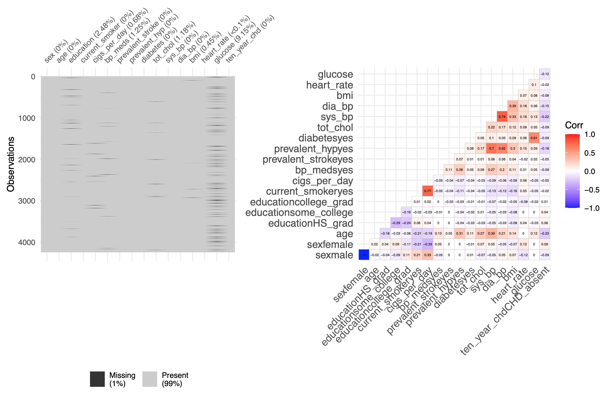

```{r libraries and setup, include = FALSE, echo = FALSE}
10# TM: are we using all of these? can we remove if not?
library(tidyverse)
library(ggplot2)
library(skimr)
library(visdat)
library(reshape2)
library(DataExplorer)
library(ggcorrplot) # I prefer this option, we should remove whichever lib we don't use
library(caret)
library(vip)
library(mgcv)
library(klaR)
library(pROC)
library(ggridges)
library(corrplot)
library(AppliedPredictiveModeling)
library(patchwork)
library(Hmisc)
library(groupdata2)
library(reshape)
library(recipes)
library(glmnet)
library(rpart.plot)
library(MASS)
library(glmnet)
library(nnet)
library(xgboost)
library(NeuralNetTools)  
library(Ckmeans.1d.dp)
library(kableExtra)
library(Polychrome)
library(cowplot)
library(plotmo)

knitr::opts_chunk$set(
  echo = TRUE,
  warning = FALSE,
  message = FALSE,
  cache = TRUE,
  include = FALSE,
  fig.height = 6,
  fig.width = 8
  )

theme_set(theme_minimal() + theme(
  legend.position = "bottom",
  plot.title = element_text(hjust = 0.5)
))

options(
  ggplot2.continuous.colour = "viridis",
  ggplot2.continuous.fill = "viridis",
  digits = 3)

scale_colour_discrete = scale_colour_viridis_d
scale_fill_discrete = scale_fill_viridis_d
```

## Introduction

```{r importing and cleaning data, include = FALSE, eval = TRUE}
# Read in all data
# source: https://raw.githubusercontent.com/TarekDib03/Analytics/master/Week3%20-%20Logistic%20Regression/Data/framingham.csv
all_df = read_csv("FHS.csv")

# Factor labels for categorical variables and other recoding
cleaned_df = all_df %>% 
  mutate(male = factor(male),
         current_smoker = factor(current_smoker),
         bp_meds = factor(bp_meds),
         prevalent_stroke = factor(prevalent_stroke),
         prevalent_hyp = factor(prevalent_hyp),
         diabetes = factor(diabetes),
         ten_year_chd = factor(ten_year_chd))  %>%
  mutate(ten_year_chd = ifelse(ten_year_chd == "1", "CHD_present","CHD_absent") %>%
           fct_relevel("CHD_present", "CHD_absent")) %>%
  dplyr::rename(sex = male) %>%
  mutate(sex = ifelse(sex == "1", "male","female") %>%
           fct_relevel("male", "female")) %>% 
  mutate(
    education = case_when(
      education == "1" ~ "some_HS",
      education == "2" ~ "HS_grad",
      education == "3" ~ "some_college",
      education == "4" ~ "college_grad"
    ),
    current_smoker = recode(
      current_smoker,
      "1" = "yes",
      "0" = "no"
    ),
    bp_meds = recode(
      bp_meds,
      "1" = "yes",
      "0" = "no"
    ),
    prevalent_stroke = recode(
      prevalent_stroke,
      "1" = "yes",
      "0" = "no"
    ),
    prevalent_hyp = recode(
      prevalent_hyp,
      "1" = "yes",
      "0" = "no"
    ),
    diabetes = recode(
      diabetes,
      "1" = "yes",
      "0" = "no"
    ),
    education = factor(education, levels = c("some_HS", "HS_grad", "some_college", "college_grad"))
  )
```

Heart disease accounts for roughly 695,000 fatalities annually in the United States alone, with known risk factors that include high cholesterol, smoking, and blood pressure. In this project, we aim to utilize observations from the Framingham cohort study to predict whether a particular study subject will or will not develop coronary heart disease over one decade’s follow-up. Our data subset of longitudinal observations come from Kaggle; its cleaning generally entailed converting appropriate variables to factors (and re-leveling where needed), as well as renaming and recoding binary 1/0 variables with more descriptive "yes" and "no" for ease of interpretation. While our midterm projects discarded observations lacking data on one or more features, this iteration attempts to overcome that limitation by using K Nearest Neighbors (KNN) imputation. The full set of data contained 4,240 total observations across 16 variables, which are:

$\text{\underline{7 categorical predictors}}$: 

* `sex` (self-reported subject sex that takes values "male" or "female")
* `education` (study participant's education that takes ordinal, mutually exclusive values "some_HS" (some high school completed), "HS_grad" (completed high school but did not attend college), "some_college" (attended college but did not graduate), and "college_grad" (graduated university))
* `current_smoker` (binary "yes" or "no" indicating whether the participant was a smoker at the time of physical examination)
* `bp_meds` (binary "yes" or "no" indicating whether the participant was using anti-hypertensive medications at the time of physical examination)
* `prevalent_stroke` (binary "yes" or "no" indicating whether the participant had experienced stroke by the time of physical examination)
* `prevalent_hyp` (binary "yes" or "no" indicating whether the participant was being treated for active hypertension at the time of physical examination)
* `diabetes` (binary "yes" or "no" indicating whether the participant was diagnosed as diabetic according to pre-specified criteria at the time of physical examination).

$\text{\underline{8 continuous numeric predictors}}$:

* `age` (age in years at the time of medical examination)
* `cigs_per_day` (average number of cigarettes smoked each day at the time of medical examination, notably not conditioned on smoking status (i.e. for those with `current_smoker` status as "no", should take the value 0))
* `tot_chol` (total blood cholesterol in mg/dL at the time of physical examination)
* `sys_BP` (systolic blood pressure in mm Hg at the time of physical examination)
* `dia_BP` (diastolic blood pressure in mm Hg at the time of physical examination)
* `bmi` (body mass index in $kg/m^2$ in mm Hg at the time of physical examination)
* `heart_rate` (resting heart rate in beats per minute at the time of physical examination)
* `glucose` (blood glucose level in mg/dL at the time of physical examination)

Finally, beyond our 15 covariates lies our outcome (response) variable `ten_year_chd`, which is a binary indicator for the presence or absence of coronary heart disease (CHD) at 10 years of follow-up. Of our 4,240 observations, 3,596 (84.8%) exhibit absence of CHD, whereas 644 (15.2%) have CHD present -- a notable class imbalance.


## Exploratory Data Analysis

```{r missing data, include = TRUE, echo = FALSE}
# Number of rows with any missing data
rows_missing_data = sum(!complete.cases(cleaned_df))

# Missing data pattern
# 582 rows (13.7% of observations) missing 1+ data points
# Highest missingness rates: glucose (9.15%), education (2.48%), bp_meds (1.25%), tot_chol (1.18%)
missing_data_viz = cleaned_df %>% 
  vis_miss()
```

Notably, 582 rows (13.7% of our observations) lacked information for at least one feature, with `glucose` accounting for the plurality of missing data (9.15% missing rate). Moving forward, we assume that our data is at least missing at random, and potentially completely at random; in other words, our missingness depends only on the observed data, and consequently it is sensible to construct a KNN imputation step (using five nearest neighbors) into our preprocessing functionality, which also includes centering, scaling, and BoxCox transformations in all possible cases.


```{r continuous variable feature plot, eval = TRUE}
# Distributions of continuous variables factored by outcome
continuous_vars_df = cleaned_df %>% 
  dplyr::select(age, cigs_per_day, tot_chol, sys_bp, dia_bp, bmi, heart_rate, glucose, ten_year_chd) %>% 
  as.data.frame()

continuous_explore = continuous_vars_df %>% 
  melt(id.vars = "ten_year_chd") %>% 
  ggplot(aes(x = value, y = ten_year_chd)) + 
  stat_density_ridges(aes(color = ten_year_chd, fill = ten_year_chd), alpha = 0.2, quantile_lines = TRUE, quantiles = 2, jittered_points = TRUE) + 
  facet_wrap(~variable, scales = "free", nrow = 2) + 
  labs(x = "",
       y = "Density",
       fill = "10 Year CHD Status",
       color = "10 Year CHD Status") +
  theme(legend.position = "none")
```

```{r categorical variable viz, eval = TRUE}
# Distributions of categorical variables factored by outcome
categorical_vars_df = cleaned_df %>% 
  dplyr::select(-age, -cigs_per_day, -tot_chol, -sys_bp, -dia_bp, -bmi, -heart_rate, -glucose) %>% 
  as.data.frame()

categorical_explore = categorical_vars_df %>% 
  melt(id.vars = "ten_year_chd") %>% 
  ggplot(aes(x = value, fill = ten_year_chd)) + 
  geom_bar(position = "fill") + 
  facet_wrap(~variable, scales = "free", nrow = 2) + 
  scale_y_continuous(labels = scales::percent) + 
  labs(x = "",
        y = "Proportion by CHD Status",
       fill = "10 Year CHD Status",
       color = "10 Year CHD Status")
```

```{r combined eda figure, eval = TRUE, include = TRUE, echo = FALSE}
(continuous_explore / categorical_explore + plot_annotation(
  title = "Fig.1: Distributions of Predictors By Outcome Class"))
```

When we stratify the distributions of our continuous predictors by outcome status, we find the most substantial differences in median age, systolic blood pressure, glucose, and daily cigarette consumption for those with and without CHD at 10 years. Looking at the proportions that have CHD present or absent across levels of our factor variables, there appears to be the most substantial differences for stroke history, diabetes status, blood pressure medication status, and hypertension prevalence. 

```{r correlation plot, eval = FALSE, echo = TRUE, fig.width=10, fig.height=7}
corr_plot <- model.matrix(~0 + ., data = cleaned_df) %>%
  cor(use = "pairwise.complete.obs") %>% 
  ggcorrplot(show.diag = F, type = "lower", lab = TRUE, lab_size = 1)

missing_data_viz + corr_plot + plot_annotation(title = "Fig. X: Missing Data and Correlation of Predictors")
```


{width=110%}

We observe no major multicollinearities, with the highest correlations (all sub-0.80) found between systolic and diastolic blood pressure, cigarette smoking and cigarettes smoked per day, prevalent hypertension and blood pressure, and glucose levels and diabetes comorbidity. In addition, CHD status is most correlated with age, systolic blood pressure, and prevalence of hypertension, which is unsurprising given our prior exploratory visualizations stratified by CHD class.

Finally, we conducted checks for various parametric model assumptions, including homogeneity of variance and normality of residuals. Overall, we found that though there were no influential outliers in the data and there was lack of significant collinearity, several of these assumptions were not quite met, which we hypothesized would mean that non-parametric methods or regression methods with regularization, such as Lasso, might be more optimal for prediction.

## Modeling

### Modeling Strategy

As mentioned, model training for our binary classification and prediction involved the use of all 15 available predictors. Early on, class imbalance was identified as a potential issue, which we attempted to rectify in prior iterations of this work through upsampling and downsampling. However, because this method was ineffective in improving our AUC, the focus here was on trying additional models, including ones with increased flexibility. We began by splitting the data into 80% training set and 20% test set. Given lack of major collinearity and use of KNN imputation for missing data points, all available predictors were included in each model unless a specific model selected them out during the training process. In total, 11 kinds of models were used, with a pre-processing step (imputation, centering, scaling, and Box-Cox transformations) included in each iteration of model training under 10-fold cross-validation, repeated five times. Seeds were set in each instance to ensure reproducibility of results, given the many assumptions and tuning parameters in our range of models. All tuning parameters were selected using cross-validation in model training to find the optimal model that maximized validation AUC. We constructed:

* **Penalized logistic regression** (elastic net, binomial family, logit link), with objective function that includes loss and penalty given our high number of predictors, and tuning on $\alpha$ (mixing proportion between L1 and L2 penalties, associated with lasso and ridge, respectively) and $\lambda$ (a penalty term that limits the number and/or magnitude of predictor coefficients) for our final model. As with a generalized linear model (i.e. logistic regression with no tuning parameters or variable selection), we assume a linear relationship between some outcome $log \frac{\pi}{1-\pi}$, where $\pi$ is a probability of 10 year CHD presence, and our predictors $X_1, …, X_n$.
* **Generalized additive model (GAM)** (also binomial family, logit link), with potential inclusion of flexible nonlinearities for some predictors, performed in `caret` for model comparison, and using general cross-validation to determine the smoothness of each operator $\hat{f_j}$ and to search over `GCV.Cp` given  unknown scale parameter.
* **Multivariate adaptive regression splines (MARS)** using `earth`, with tuning parameters (1) degree of features (number of possible hinge functions per parameter) and (2) number of terms (may not equal the number of predictors given the possibility of multiple hinge functions), including a stepwise model building procedure involving the addition of piecewise linear models / spline bases, followed by a pruning procedure. In general, MARS models tend to be well-suited for high-dimensional data problems. 
* **Linear discriminant analysis (LDA)**, which has no tuning parameters and assumes normally distributed features to classify by nearest centroid following data sphering and projection onto smaller subspaces, tends to work reasonably well with small n or well-separated classes, which doesn't appear true in our case and may make the model less robust.
* **Classification and Regression Tree (CART)**, which involves minimizing the Gini index (a measure of node purity such that a smaller value indicates a higher proportion of observations within the node from a single class) through a top-down, greedy approach that divides the feature space into a set of axis-parallel partitions, followed subsequently by cost-complexity pruning of these splits to obtain a set of optimal subtrees as a function of tuning parameter $\alpha$, selected through cross-validation. Once $\alpha$ is chosen such that mean squared prediction error from the left out k-th fold is minimized on average, a final subtree corresponding to our chosen $\alpha$ is returned, representing the final tree. Although single trees tend to be less stable than ensemble methods, such as random forest, we include them regardless simply out of interest for how much the use of multiple trees actually improves prediction accuracy. 
* **Conditional Inference Tree (CIT)**, a non-parametric alternative to CART, given CART’s tendency towards overfitting and selection bias towards covariates with many possible splits. Although CITs continue to use recursive binary partitioning, a significance test selects input variables.  Given a stopping criterion is based on p-values, the tuning parameter in this case is “mincriterion” such that a split is implemented when 1 minus the p-value exceeds this parameter, in order to ensure growing the right sized tree. Unlike CART, pruning does not occur after the largest tree is created. However, stopping may occur early. As with CART, we expect this method to be less stable than ensembles, such as random forest, but include the model here for completeness and personal interest.
* **Random Forest**, an ensemble method that generates a set of bootstrapped training samples as the basis for a set of decorrelated trees, for which a random selection of predictors is chosen as the set of candidates for splitting each time a new split is considered. As with classical classification trees, we utilize a splitting rule based on the Gini index, although other methods, such as cross-entropy, are possible. Here, we do not tune over the splitting rule because we only try the Gini method. Using the `ranger` package to implement the random forest method, our first tuning parameter, `mtry`, represents the number of randomly selected predictors used as split candidates at each split, whereas our second tuning parameter, `min.node.size`, controls the size of the tree by defining the minimum number of observations that can be included in any given terminal node.
* **Boosting**, a similar approach to random forest, however trees are grown sequentially - each tree is grown using information from previous trees. Given an initial tree, a second tree is fit to the residuals from the first. This second tree is then added into the fitted function in order to update the residuals. Iterative trees are typically small with just a few terminal nodes, determined by number of splits parameter *d*, leading to relatively slow learning. The shrinkage parameter $\lambda$ controls the speed of this process to avoid overfitting. The total number of trees, B, is the remaining tuning parameter for this method. If B is too large, the boosted model can overfit the training data.
* **Support Vector Machine (SVM with Linear and Radial Kernels)**, which involves the construction of a hyperplane that maximizes separability, or soft margin between data points of each of the two classes, in high-dimensional feature space, thereby minimizing generalization error.  Only some proportion of the training observations serve as support vectors, which lie closest to the hyperplane, or decision surface, and would change that hyperplane’s location if removed. Given that the sets between which we’d like to discriminate tend not to be linearly separable, a radial kernel, which results in non-linear decision boundaries, is also used in practice. *Note: we are well aware that SVM should not generally be used to estimate probability of class membership, and that as a result, the AUC metric is not applicable given the weaknesses of Platt calibration. When checking the SVM model, we look therefore not only at the AUC metric, but also the model accuracy and kappa, ultimately determining that regardless of the metric, SVMs are weaker classifiers than some of our better models.* For the linear kernel, our tuning parameter is cost, which is selected using cross-validation and represents the penalty associated with having an observation on the incorrect side of the classification boundary. The smaller the cost, the less flexible the model (unlike, say, the comparable parameter associated with lasso). For the radial kernel, we add a second tuning parameter, sigma, which controls model flexibility (higher gamma means more flexible model) and is also selected with cross-validation. One inherent limitation to our radial SVM is that we chose to train on only 15% of the training dataset due to computing limitations. This can improve speed of training the model while sacrificing relatively little discretionary performance because the primary focus of SVM models is the boundary between classes rather than the full scope of observations.
* **Neural Network**, which mimics a biological nervous system by modeling connections with weights between nodes. Each predictor is considered an input, which is then modified by weight and summed into a linear combination; this may occur iteratively through sets of hidden layers until one final output layer is reached. Activation functions provide non-linearity to neural networks, and for classification tasks, the softmax activation function (a generalization of logistic functions used for multiclass problems) tends to be used in order to normalize the network outputs to a multinomial probability distribution over predicted output classes. Our model has two tuning parameters set by cross-validation: decay and size. Decay, or weight decay, is a regularization technique applied to network weights in order to reduce overfitting, while size is the number of units in the hidden layer, and can be zero if there are skip-layer units. 

```{r model tuning setup full data set}
set.seed(2022)

# Training/testing partition
index_train = createDataPartition(cleaned_df$ten_year_chd, 
                                  p = 0.8,
                                  list = FALSE)

training_df = cleaned_df[index_train, ]
testing_df = cleaned_df[-index_train, ]

# Model matrices
x_train = model.matrix(ten_year_chd ~ ., training_df)[, -1] # Note that if a row has NAs, it is by default removed using model.matrix!
x_test = model.matrix(ten_year_chd ~ ., testing_df)[, -1]
y_train = training_df$ten_year_chd
y_test = testing_df$ten_year_chd

# Train control with 10-fold cross-validation repeated 5 times
ctrl = trainControl(method = "repeatedcv",
                    repeats = 5,
                    summaryFunction = twoClassSummary,
                    classProbs = TRUE)
```

```{r preprocessing with recipe}
# Preprocessing and feature engineering with recipe (including imputation)
# Note: assuming data is MAR

# recipe of preprocessing steps
preprocess_recipe = recipe(ten_year_chd ~ ., data = training_df) %>%
  step_impute_knn(all_predictors(), neighbors = 5) %>%  # KNN imputation based on 5 nearest neighbors
  step_BoxCox(all_numeric_predictors()) %>% # transform predictors
  step_center(all_numeric_predictors()) %>% # center and scale numeric predictors
  step_scale(all_numeric_predictors())
```

```{r GLMNet imputation in caret}
# Penalized logistic regression with imputation in caret function directly (NOT recipes)
set.seed(2022)

glm_grid = expand.grid(alpha = seq(0, 1, length = 11),
                       lambda = exp(seq(-8, -3, length = 19)))

ctrl_glmnet = trainControl(method = "repeatedcv",
                    repeats = 5,
                    summaryFunction = twoClassSummary,
                    classProbs = TRUE,
                    preProcOptions = list(k = 5))

logit_next = train(ten_year_chd ~ .,
                   data = training_df,
                   na.action = na.pass,
                  method = "glmnet",
                  tuneGrid = glm_grid,
                  metric = "ROC",
                  trControl = ctrl_glmnet,
                  family = "binomial",
                  preProcess = c("knnImpute", "center", "scale", "BoxCox"))

# Test data: predicted probabilities
glmnet_pred_test_probs = predict(logit_next, newdata = testing_df, type = "prob",
                                 na.action = na.pass)[,1]

# Test data: predicted classes
glmnet_pred_test_class = predict(logit_next, newdata = testing_df, type = "raw",
                                 na.action = na.pass)

# Test data: confusion matrix
# Accuracy: 0.854
confusionMatrix(data = glmnet_pred_test_class,
                reference = y_test)
```

```{r random forest imputation with recipes}
# Random forest with imputation from recipes package
set.seed(2022)

# RF grid
rf_grid_one = expand.grid(mtry = 1:8,
                      splitrule = "gini",
                      min.node.size = seq(from = 6, to = 14, by = 2))

# Train random forest model
rf_fit = train(preprocess_recipe,
              data = training_df,
              method = "ranger",
              tuneGrid = rf_grid_one,
              metric = "ROC",
              trControl = ctrl)

# Test data: predicted probabilities
rf_pred_test_probs = predict(rf_fit, newdata = testing_df, type = "prob")[,1]

# Test data: predicted classes
rf_pred_test_class = predict(rf_fit, newdata = testing_df, type = "raw")

# Test data: confusion matrix
# Accuracy: 0.849
confusionMatrix(data = rf_pred_test_class,
                reference = y_test)
```

```{r random forest imputation in caret}
# Random forest with imputation from caret function directly (NOT recipes)
set.seed(2022)

ctrl_RF = trainControl(method = "repeatedcv",
                    repeats = 5,
                    summaryFunction = twoClassSummary,
                    classProbs = TRUE,
                    preProcOptions = list(k = 5))

rf_grid_two = expand.grid(mtry = 1:8,
                      splitrule = "gini",
                      min.node.size = seq(from = 2, to = 10, by = 2))

rf_caret = train(ten_year_chd ~ .,
                   data = training_df,
                   na.action = na.pass,
                  method = "ranger",
                  tuneGrid = rf_grid_two,
                  metric = "ROC",
                  trControl = ctrl_RF,
                  preProcess = c("knnImpute", "center", "scale", "BoxCox"))

# Test data: predicted probabilities
rf_caret_pred_test_probs = predict(rf_caret, newdata = testing_df, type = "prob",
                                   na.action = na.pass)[,1]

# Test data: predicted classes
rf_caret_pred_test_class = predict(rf_caret, newdata = testing_df, type = "raw",
                                   na.action = na.pass)

# Test data: confusion matrix
# Accuracy: 0.849
confusionMatrix(data = rf_caret_pred_test_class,
                reference = y_test)
```

```{r boosting imputation with recipes}
# Boosting with imputation from recipes package
set.seed(2022)

# Grid search for adaboost
adaboost_grid = expand.grid(n.trees = c(4000,5000,6000),
                            interaction.depth = 1:6,
                            shrinkage = c(0.001,0.002,0.004),
                            n.minobsinnode = 1)

# Train boosting model
boost_fit = train(preprocess_recipe,
                  data = training_df,
                  tuneGrid = adaboost_grid,
                  trControl = ctrl,
                  method = "gbm",
                  distribution = "adaboost",
                  metric = "ROC",
                  verbose = FALSE)

# Test data: predicted probabilities
boost_pred_test_probs = predict(boost_fit, newdata = testing_df, type = "prob")[,1]

# Test data: predicted classes
boost_pred_test_class = predict(boost_fit, newdata = testing_df, type = "raw")

# Test data: confusion matrix
# Accuracy: 0.854
confusionMatrix(data = boost_pred_test_class,
                reference = y_test)
```

```{r boosting imputation with caret}
# Boosting with imputation directly from caret (NOT recipes)
set.seed(2022)

ctrl_boost = trainControl(method = "repeatedcv",
                    repeats = 5,
                    summaryFunction = twoClassSummary,
                    classProbs = TRUE,
                    preProcOptions = list(k = 5))

# Train boosting model
boost_caret = train(ten_year_chd ~ .,
                   data = training_df,
                   na.action = na.pass,
                  tuneGrid = adaboost_grid,
                  trControl = ctrl_boost,
                  method = "gbm",
                  distribution = "adaboost",
                  metric = "ROC",
                  verbose = FALSE,
                  preProcess = c("knnImpute", "center", "scale", "BoxCox"))

# Test data: predicted probabilities
boost_caret_pred_test_probs = predict(boost_caret, newdata = testing_df, type = "prob",
                                   na.action = na.pass)[,1]

# Test data: predicted classes
boost_caret_pred_test_class = predict(boost_caret, newdata = testing_df, type = "raw",
                                   na.action = na.pass)

# Test data: confusion matrix
# Accuracy: 0.851
confusionMatrix(data = boost_caret_pred_test_class,
                reference = y_test)
```

```{r CART tree}
# CART tree with recipe imputation
set.seed(2022)

cart_fit = train(preprocess_recipe,
                  data = training_df, 
                   method = "rpart",
                   tuneGrid = data.frame(cp = exp(seq(-9,-5, len = 50))),
                   trControl = ctrl,
                   metric = "ROC")

# Test data: predicted probabilities
cart_pred_prob_test = predict(cart_fit, newdata = testing_df,
                       type = "prob")[,1]

# Test data: predicted classes
cart_pred_class_test = predict(cart_fit, newdata = testing_df, type = "raw")

# Test data: confusion matrix
# Accuracy: 0.799
confusionMatrix(data = cart_pred_class_test,
                reference = y_test)
```

```{r CIT tree}
# CIT tree with recipe imputation
set.seed(2022)

cit_fit = train(preprocess_recipe,
                  data = training_df,
                   method = "ctree",
                   tuneGrid = data.frame(mincriterion = 1-exp(seq(-3, 0, length = 50))),
                   metric = "ROC",
                   trControl = ctrl)

# Test data: predicted probabilities
cit_pred_prob_test = predict(cit_fit, newdata = testing_df,
                       type = "prob")[,1]

# Test data: predicted classes
cit_pred_class_test = predict(cit_fit, newdata = testing_df, type = "raw")

# Test data: confusion matrix
# Accuracy: 0.844
confusionMatrix(data = cit_pred_class_test,
                reference = y_test)
```

```{r SVM linear caret impute}
# SVM linear with impute in caret directly
# ROC seems < 0.6, quite poor
set.seed(2022)

ctrl_linear_svm = trainControl(method = "repeatedcv",
                    repeats = 5,
                    summaryFunction = twoClassSummary,
                    classProbs = TRUE,
                    preProcOptions = list(k = 5))

# I know we're told not to do this, but including Platt's probabilistic outputs here just to see...
svm_linear_fit = train(ten_year_chd ~ .,
                       data = training_df,
                       na.action = na.pass,
                       method = "svmLinear",
                       tuneGrid = data.frame(C = exp(seq(-5, 2, len = 50))),
                       trControl = ctrl_linear_svm,
                       prob.model = TRUE,
                  preProcess = c("knnImpute", "center", "scale", "BoxCox")
                       )

# Test data: predicted probabilities
svm_linear_pred_prob_test = predict(svm_linear_fit, newdata = testing_df,
                       type = "prob", na.action = na.pass)[,1]

# Test data: predicted classes
svm_linear_pred_class_test = predict(svm_linear_fit, newdata = testing_df, type = "raw",
                                     na.action = na.pass)

# Test data: confusion matrix
# Accuracy: 0.849
confusionMatrix(data = svm_linear_pred_class_test,
                reference = y_test)
```

```{r loading svm radial results}
load("svm_radial_res.RData")
```

```{r SVM radial caret impute, eval = FALSE}
# Train control with 10-fold cross-validation repeated 5 times
ctrl_radial_svm = trainControl(method = "repeatedcv",
                               repeats = 5,
                               summaryFunction = twoClassSummary,
                               classProbs = TRUE,
                               preProcOptions = list(k = 5))

# down-sampling for radial svm
set.seed(2022)
down_ind <- createDataPartition(training_df$ten_year_chd,
                                p = 0.15,
                                list = FALSE)
down_df <- training_df[down_ind,]

# Trying SVM with radial classifier for fun
set.seed(2022)

svm_grid = expand.grid(C = exp(seq(-2, 3, len = 50)),
                       sigma = exp(seq(-3, 0, len = 50)))

# I know we're told not to do this, but including Platt's probabilistic outputs here just to see...
svm_radial_fit_impute = train(ten_year_chd ~ .,
                             data = down_df,
                             method = "svmRadialSigma",
                             tuneGrid = svm_grid,
                             trControl = ctrl_radial_svm,
                             prob.model = TRUE,
                             na.action = na.pass,
                             preProcess = c("knnImpute", "center", "scale", "BoxCox"))

svm_radial_pred_prob_test = predict(svm_fit_impute_probs, newdata = testing_df,
                       type = "prob", na.action = na.pass)[,1]

svm_radial_pred_class_test = predict(svm_fit_impute_probs, newdata = testing_df, type = "raw",
                                     na.action = na.pass)
```

```{r LDA}
# LDA in caret, imputation from caret (recipes gives errors, non-numeric argument to binary operator)
set.seed(2022)

lda_ctrl = trainControl(method = "repeatedcv",
                    repeats = 5,
                    summaryFunction = twoClassSummary,
                    classProbs = TRUE,
                    preProcOptions = list(k = 5))

LDA_model_caret = train(ten_year_chd ~ .,
                  data = training_df,
                  na.action = na.pass,
                  method = "lda",
                  metric = "ROC",
                  trControl = lda_ctrl,
                  preProcess = c("knnImpute", "center", "scale", "BoxCox"))

# Examine results
# AUC: 0.716
LDA_model_caret$results

# Test data: predicted probabilities
lda_pred_prob_test = predict(LDA_model_caret, newdata = testing_df,
                       type = "prob", na.action = na.pass)[,1]

# Test data: predicted classes
lda_pred_class_test = predict(LDA_model_caret, newdata = testing_df, type = "raw",
                                     na.action = na.pass)

# Test data: confusion matrix
# Accuracy: 0.85
confusionMatrix(data = lda_pred_class_test,
                reference = y_test)
```

```{r}
### Neural Network Model with imputation

set.seed(2022)
nnet_fit_impute <- train(preprocess_recipe,
                         data = training_df,
                         method = "nnet",
                         tuneGrid =  expand.grid(decay = exp(seq(-1, 2.5, len = 15)),  
                                                 size = c(1:5)),
                         metric = "ROC",
                         trControl = ctrl)

#Note that when we impute the model, we should use testing data with missing values (NA)
nnet_impute_pred_test_probs <- predict(nnet_fit_impute, newdata = testing_df, type = "prob")[,1]
```

```{r}
#### Averaged Neural Network Model with imputation
#
#set.seed(2022)
#avnet_fit_impute <- train(preprocess_recipe,
#                          data = training_df,
#                          method = "avNNet",
#                          MaxNWts = numWts, #maximum allowable weights
#                          maxit = 1000, 
#                          tuneGrid = my.grid, 
#                          trace = FALSE, 
#                          metric = "ROC",
#                          trControl = ctrl)
#
#avnnet_impute_pred_test_probs <- predict(avnet_fit_impute, newdata = testing_df, type = "prob")[,1]
```

```{r}
### MARS Model with imputation
set.seed(2022)
mars_fit_impute <- train(preprocess_recipe,
                         data = training_df,
                         method = "earth",
                         tuneGrid = expand.grid(degree = 1:3, 
                                                nprune = 2:35),
                         metric = "ROC",
                         trControl = ctrl)

mars_impute_pred_test_probs <- predict(mars_fit_impute, newdata = testing_df, type = "prob")[,1]
```

```{r}
### GAM Model with imputation
set.seed(2022)

GAM_fit_impute <- train(preprocess_recipe,
                        data = training_df,
                        method = "gam",
                        metric = "ROC",
                        family = "binomial",
                        tuneGrid = data.frame(method = "GCV.Cp", select = c(TRUE, FALSE)),
                        trControl = ctrl)

gam_impute_pred_test_probs <- predict(GAM_fit_impute, newdata = testing_df, type = "prob")[,1]
```

### Optimal Tuning Parameters

Our tuning parameters were selected via 10-fold cross-validation repeated 5 times using only the training data to maximize validation AUC. We chose AUC as an evaluation measure because it is generally invariant to classification decision boundaries. Our optimal elastic net model had parameters $\alpha$ = 0.3 and $\lambda$ = 0.0164, where $\alpha$ = 0 indicates pure ridge regression and $\alpha$ = 1 indicates pure LASSO regression, so our final model is closer to  ridge. The optimal MARS model had a product degree of 1 and ‘nprune’ of 6. Our optimal random forest model used 1 randomly selected predictor and a minimum node size of 2 observations per node. Our optimal boosted model had a maximum tree depth of 1 with 5,000 boosting iterations and a shrinkage factor of 0.002. The optimal cost parameter for linear SVM was 0.00777. Our optimal radial SVM model had a $\sigma$ value of 0.0498 and a cost parameter of 2.61. The optimal parameters for our neural network model were size 2 and decay of 1.65.

```{r, include = TRUE, echo = FALSE, fig.width=12, fig.height=14}
# Optimal tuning parameters: GLMNet
# Alpha = 0.3, Lambda = 0.0164
#logit_next$bestTune

# Plots of optimal tuning parameters for GLMnet
#myCol = rainbow(15)
#myPar = list(superpose.symbol = list(col = myCol),
#             superpose.line = list(col = myCol))
#
#plot(logit_next, par.settings = myPar, xTrans = function(x) log(x))

#logit_tuning_graph = ggplot(logit_next, highlight = T) + 
#  scale_x_continuous(trans = "log") + 
#  labs(title = "Penalized Logistic Regression",
#       x = "Lambda",
#       y = "AUC")

g1 <- 
  logit_next$results %>%
  mutate(best_lambda = logit_next$bestTune$lambda) %>%
  ggplot(aes(x = lambda, y = ROC, group = alpha, color = alpha)) + geom_point(shape = 1) +
  geom_point(aes(best_lambda, max(ROC)), size = 2, shape = 5, color = "black") +
  geom_line() +
  scale_color_gradientn(colours = rainbow(10)) +
  labs(title = "Elastic Net",
       subtitle = "Alpha = 0.3 & Lambda = 0.016",
       y = "AUC",
       x = "Regularizaiton parameter")  + labs(color = 'Alpha') +
  theme(plot.subtitle=element_text(size=10, hjust=0.5, face="italic", color="black")) +
  theme(plot.title = element_text(hjust = 0.5, face = "bold"))


# Optimal tuning parameters RF Recipe: 1 randomly selected predictor, min node size = 10
# Note: try tuning parameters > 10 min node size in grid?
g2 <- ggplot(rf_fit, highlight = TRUE) + labs(title = "Random Forest", y = "AUC") +
  theme(plot.title = element_text(hjust = 0.5, face = "bold"))

# Optimal tuning parameters RF Caret: 1 randomly selected predictor, min node size = 2
#ggplot(rf_caret, highlight = TRUE)

# Optimal tuning parameters Boost Recipe: max tree depth = 1, 5000 boosting iterations, shrinkage = 0.002
# Try more boosting iterations and higher shrinkage?
g3 <- ggplot(boost_fit, highlight = TRUE) + labs(title = "Adaboost", y = "AUC") +
  theme(plot.title = element_text(hjust = 0.5, face = "bold"))

# Optimal tuning parameters Boost Caret
# Max tree depth = 1, 5000 boosting iterations, shrinkage = 0.002
# Try more boosting iterations and higher shrinkage?
#ggplot(boost_caret, highlight = TRUE)

# Optimal tuning parameter CART
g4 <- ggplot(cart_fit, highlight = TRUE) + labs(title = "Classification Tree", y = "AUC") +
  theme(plot.title = element_text(hjust = 0.5, face = "bold"))

# Optimal tuning parameter CIT
# Re-run with changed mincriterion (tuning parameter)
g5 <- ggplot(cit_fit, highlight = TRUE) + labs(title = "Conditional Inference Tree", y = "AUC") +
  theme(plot.title = element_text(hjust = 0.5, face = "bold"))

# Optimal tuning parameters SVM linear
#plot(svm_linear_fit, highlight = TRUE, xTrans = log)

# Optimal tuning parameters SVM radial
#plot(svm_radial_fit_impute, transform.y = log,
#     transform.x = log)

#g5 <- ggplot(svm_linear_fit, highlight = T) + labs(title = "SVM Linear", y = "AUC") +
#  theme(plot.title = element_text(hjust = 0.5, face = "bold"))

g6 <- ggplot(svm_radial_fit_impute, highlight = T) + labs(title = "SVM Radial", y = "AUC") +
  theme(plot.title = element_text(hjust = 0.5, face = "bold"), legend.position = "none")

#Optimal tuning parameters Neural Network
g7 <- ggplot(nnet_fit_impute, highlight = T) + labs(title = "Neural Network", y = "AUC") +
  theme(plot.title = element_text(hjust = 0.5, face = "bold"))

# Optimal tuning parameters Averaged Neural Network
#ggplot(avnet_fit_impute, highlight = T)

# Optimal tuning parameters MARS
g8 <- ggplot(mars_fit_impute, highlight = T) + labs(title = "MARS", y = "AUC") +
  theme(plot.title = element_text(hjust = 0.5, face = "bold"))

# GAM tuning parameter plot looks like an empty plot (professor also doesn't include in her code)

(g1 + g2)/(g3 + g4)/(g5 + g6)/(g7 + g8)

```

### Variable Importance

The most important variables in our elastic net model were age, systolic blood pressure, sex, and cigarettes per day. The GAM identified age, glucose, and sex as the most important variables. The most important variables in the MARS model were systolic blood pressure, age, sex, and glucose. For our random forest model, we looked at permutation and impurity methods to assess variable importance. When using the permutation method, we identified systolic blood pressure, diastolic blood pressure, prevalence of hypertension, and glucose as important variables. Similarly, when using the impurity method, we identified systolic blood pressure, age, diastolic blood pressure, and glucose. The most important variables in our boosted model were age, systolic blood pressure, glucose, and cigarettes per day. Our neural network model identified similar important variables in age, glucose, and systolic blood pressure.

Overall, we tended to see the following variables as being important across our analysis: systolic blood pressure, age, glucose, and sex. This is perhaps unsurprising given our exploratory data analysis and relatively better class separability for these features than for others.

```{r}
# Variable importance: GLMNet
# Most important variables: age, sys_bp, sexfemale, cigs_per_day
logit_vip_graph = vip(logit_next, num_features = 11, method = "model",
                      aesthetics = list(fill = "skyblue")) + ggtitle("Elastic Net VIP")
g3 <- logit_vip_graph

# Variable importance RF recipe: permutation / gini
# sys_bp, dia_bp, glucose, prevalent_hyp
rf_recipe_var_imp_permutation = ranger(ten_year_chd ~ ., 
                           training_df[complete.cases(training_df),],
                           mtry = rf_fit$bestTune[[1]],
                           splitrule = "gini",
                           min.node.size = rf_fit$bestTune[[3]],
                           importance = "permutation",
                           scale.permutation.importance = TRUE)

barplot(sort(ranger::importance(rf_recipe_var_imp_permutation), decreasing = FALSE),
                las = 2, horiz = TRUE, cex.names = 0.7,
                col = colorRampPalette(colors = c("cyan", "blue"))(12), 
                main = "Random Forest Permutation VIP")

# Variable importance RF recipe: impurity / gini
# sys_bp, age, dia_bp, glucose
rf_recipe_var_imp_impurity = ranger(ten_year_chd ~ ., 
                           training_df[complete.cases(training_df),],
                           mtry = rf_fit$bestTune[[1]],
                           splitrule = "gini",
                           min.node.size = rf_fit$bestTune[[3]],
                           importance = "impurity",
                           scale.permutation.importance = TRUE)

barplot(sort(ranger::importance(rf_recipe_var_imp_impurity), decreasing = FALSE),
        las = 2, horiz = TRUE, cex.names = 0.7,
        col = colorRampPalette(colors = c("cyan", "blue"))(12), main = "Random Forest Impurity VIP")


# Variable importance RF caret: permutation / gini
# sys_bp, dia_bp, prevalent_hyp, glucose
#rf_caret_var_imp_permutation = ranger(ten_year_chd ~ ., 
#                           training_df[complete.cases(training_df),],
#                           mtry = rf_caret$bestTune[[1]],
#                           splitrule = "gini",
#                           min.node.size = rf_caret$bestTune[[3]],
#                           importance = "permutation",
#                           scale.permutation.importance = TRUE)

#barplot(sort(ranger::importance(rf_caret_var_imp_permutation), decreasing = FALSE),
#        las = 2, horiz = TRUE, cex.names = 0.7,
#        col = colorRampPalette(colors = c("cyan", "blue"))(12))

# Variable importance RF caret: impurity / gini
# sys_bp, age, dia_bp, glucose
#rf_caret_var_imp_impurity = ranger(ten_year_chd ~ ., 
#                           training_df[complete.cases(training_df),],
#                           mtry = rf_caret$bestTune[[1]],
#                           splitrule = "gini",
#                           min.node.size = rf_caret$bestTune[[3]],
#                           importance = "impurity",
#                           scale.permutation.importance = TRUE)
#
#barplot(sort(ranger::importance(rf_caret_var_imp_impurity), decreasing = FALSE),
#        las = 2, horiz = TRUE, cex.names = 0.7,
#        col = colorRampPalette(colors = c("cyan", "blue"))(12))

# Variable importance Boost Recipe
# age, sys_bp, glucose, cigs_per_day

# Variable importance Boost Caret
# age, sys_bp, glucose, cigs_per_day
#summary(boost_caret$finalModel, las = 2, cBars = 19, cex.names = 0.6)


summary(boost_fit$finalModel, las = 2, cBars = 19, cex.names = 0.6)


# Final model CART
rpart.plot(cart_fit$finalModel)

# Final model CIT
plot(cit_fit$finalModel)

# Variable importance Neural Network
g5 <-
  vip(nnet_fit_impute$finalModel, num_features = 6, method = "model",
    aesthetics = list(fill = "skyblue")) + ggtitle("Neural Network VIP")

#V <- varImp(nnet_fit_impute$finalModel)
#
#ggplot(V, aes(x = reorder(rownames(V),Overall), y = Overall)) +
#  geom_point(color = "blue", size = 2, alpha = 0.6) +
#  geom_segment(aes(x = rownames(V), xend = rownames(V), y = 0, yend = Overall), 
#              color = 'skyblue') +
#  xlab('Variable') +
#  ylab('Overall Importance') +
#  theme_light() +
#  coord_flip() 

# Neural Network model plot
plotnet(nnet_fit_impute$finalModel)

#Variable importance MARS
V3 <- varImp(mars_fit_impute$finalModel)

g6 <-
  ggplot(V3, aes(x = reorder(rownames(V3),Overall), y = Overall, fill = Overall)) +
  geom_bar(stat="identity", fill = "skyblue") +
  xlab('') +
  ylab('Importance') +
  labs(title = "MARS VIP") +
  theme_light() +
  coord_flip() 
 

df <- data.frame(importance = rf_recipe_var_imp_permutation$variable.importance)
df$variable <- rownames(df)

g2 <-  ggplot(df, aes(x = reorder(variable, importance), y = importance, fill = importance)) + 
       geom_bar(stat="identity", position="dodge", fill = "skyblue") + coord_flip() +
       ylab("Importance") +
       xlab("") +
       ggtitle("Random Forest VIP")

```

```{r, include = TRUE, echo=FALSE}
 g2 <-  ggplot(df, aes(x = reorder(variable, importance), y = importance, fill = importance)) + 
       geom_bar(stat="identity", position="dodge", fill = "skyblue") + coord_flip() +
       ylab("Importance") +
       xlab("") +
       ggtitle("Random Forest VIP")
  
    
plot_grid(g2, g5, g3, g6, ncol = 2)

```

### Resampling Results and Model Selection

Having trained and fit both more and less flexible models, we then explore the resampling AUC across models and find generally limited stratification between methods with a couple of notable exceptions – namely, significantly lower performance from support vector machines in particular, but also from our tree models (classification tree especially). Although the SVM with a radial kernel did indeed provide significant improvement over the linear SVM as hypothesized, the performance was still far below our other models. This may be in part due to the fact that given the limitations of our machine power, we could only train the radial SVM on a much smaller proportion of our training observations, which leaves room for future exploration. Again, we also note that SVMs cannot quite be compared on AUC given the use of Platt’s probabilities; regardless, we check other metrics, such as accuracy and kappa, and find that these, too, underperform other models – so we would not select SVM models anyway.

Our top 5 models (elastic net, MARS, neural network, LDA, and GAM) are all extremely close in resampling AUC, falling in the 0.716 to 0.721 range. In general, we prefer to use the simplest, easiest-to-interpret model, which luckily also happens to be our highest performing model on this metric: the elastic net model. Our elastic net model has an AUC of 0.721 and is closer to the ridge model than to LASSO. This AUC means that even our best model is only “okay” or “decent”; its accuracy of just over 85% is also not significantly above the No Information Rate of 84.9%, which means we see only marginal improvement once we take into account the inherent class imbalance found in our data. As noted, upsampling or manual changes to the probability threshold for classification did not ultimately lead to significant improvement, hence its omission here. It’s also worth noting that though none of our models achieves a particularly high sensitivity, the elastic net model also achieves a middle ground in the sensitivity/specificity tradeoff, falling in the middle of the pack compared to other models on both metrics.

```{r}
# Results from resampling on training data 
#resamp = resamples(list(random_forest_recipes_impute = rf_fit, 
#                        adaboost_recipes_impute = boost_fit,
#                        glmnet = logit_next,
#                        random_forest_caret_impute = rf_caret,
#                        boost_caret_impute = boost_caret,
#                        cart_tree = cart_fit,
#                        cit_tree = cit_fit,
#                        svm_linear = svm_linear_fit,
#                        svm_radial = svm_radial_fit_impute,
#                        lda = LDA_model_caret,
#                        Neural_Network_Impute = nnet_fit_impute,
#                        MARS_Impute = mars_fit_impute))
#GAM_Impute = GAM_fit_impute
                        

# Median AUC is highest for glmnet (0.727), and boost_caret_impute (0.722)                   
#summary(resamp)

#bwplot(resamp, layout = c(3, 1))
```

```{r resampling train results, include = TRUE, echo = FALSE, fig.height=10, fig.width=10}
# Results from resampling on training data 
resamp = resamples(list(Random_Forest = rf_fit, 
                        Adaboost = boost_fit,
                        Elastic_Net = logit_next,
                        Classfication_Tree = cart_fit,
                        Conditional_Inference_Tree = cit_fit,
                        SVM_Linear = svm_linear_fit,
                        SVM_Radial = svm_radial_fit_impute,
                        LDA = LDA_model_caret,
                        Neural_Network = nnet_fit_impute,
                        MARS = mars_fit_impute,
                        GAM = GAM_fit_impute))

# Median AUC is highest for glmnet (0.727), and boost_caret_impute (0.722)                   
result <- summary(resamp) 

ROC_df <-  
  tibble(Random_Forest = result$values$`Random_Forest~ROC`,
         Adaboost = result$values$`Adaboost~ROC`,
         Elastic_Net = result$values$`Elastic_Net~ROC`,
         Classfication_Tree = result$values$`Classfication_Tree~ROC`,
         Conditional_Inference_Tree = result$values$`Conditional_Inference_Tree~ROC`,
         SVM_Linear = result$values$`SVM_Linear~ROC`,
         SVM_Radial = result$values$`SVM_Radial~ROC`,
         LDA = result$values$`LDA~ROC`,
         Neural_Network = result$values$`Neural_Network~ROC`,
         MARS = result$values$`MARS~ROC`,
         GAM = result$values$`GAM~ROC`) %>% 
  pivot_longer(Random_Forest:GAM, names_to = "method", values_to = "values")

Sens_df <-  
  tibble(Random_Forest = result$values$`Random_Forest~Sens`,
         Adaboost = result$values$`Adaboost~Sens`,
         Elastic_Net = result$values$`Elastic_Net~Sens`,
         Classfication_Tree = result$values$`Classfication_Tree~Sens`,
         Conditional_Inference_Tree = result$values$`Conditional_Inference_Tree~Sens`,
         SVM_Linear = result$values$`SVM_Linear~Sens`,
         SVM_Radial = result$values$`SVM_Radial~Sens`,
         LDA = result$values$`LDA~Sens`,
         Neural_Network = result$values$`Neural_Network~Sens`,
         MARS = result$values$`MARS~Sens`,
         GAM = result$values$`GAM~Sens`) %>% 
  pivot_longer(Random_Forest:GAM, names_to = "method", values_to = "values")

Spec_df <-  
  tibble(Random_Forest = result$values$`Random_Forest~Spec`,
         Adaboost = result$values$`Adaboost~Spec`,
         Elastic_Net = result$values$`Elastic_Net~Spec`,
         Classfication_Tree = result$values$`Classfication_Tree~Spec`,
         Conditional_Inference_Tree = result$values$`Conditional_Inference_Tree~Spec`,
         SVM_Linear = result$values$`SVM_Linear~Spec`,
         SVM_Radial = result$values$`SVM_Radial~Spec`,
         LDA = result$values$`LDA~Spec`,
         Neural_Network = result$values$`Neural_Network~Spec`,
         MARS = result$values$`MARS~Spec`,
         GAM = result$values$`GAM~Spec`) %>% 
  pivot_longer(Random_Forest:GAM, names_to = "method", values_to = "values")

result1 <-
  ROC_df %>% 
  ggplot(aes(x = reorder(method, values), values, color = method)) + 
  geom_boxplot(fatten = NULL, alpha = 0.3) +
  stat_summary(fun.y = mean, geom = "errorbar", aes(ymax = ..y.., ymin = ..y..),
               width = 0.75, size = 1, linetype = "solid") + 
  coord_flip() +
  labs(title = "Distribution of the CV Estimated AUC", 
       subtitle = "Middle box line represents mean of AUC",
       x = "Model", y = "Area under the ROC curve",
       caption = "") +
  theme(plot.title = element_text(size = 10, hjust = 0.5, face = "bold"),
        plot.subtitle = element_text(size = 7, hjust = 0.5),
        plot.caption = element_text(hjust = 0.5),
        legend.position = "none")

result2 <-
  Sens_df %>% 
  ggplot(aes(x = reorder(method, values), values, color = method)) + 
  geom_boxplot(fatten = NULL, alpha = 0.3) +
  stat_summary(fun.y = mean, geom = "errorbar", aes(ymax = ..y.., ymin = ..y..),
               width = 0.75, size = 1, linetype = "solid") + 
  coord_flip() +
  labs(title = "Fig.5 Distribution of the CV Estimated Sensitivity", 
       subtitle = "Middle box line represents mean of sensitivity",
       x = "Model", y = "Sensitivity",
       caption = "") +
  theme(plot.title = element_text(size = 10, hjust = 0.5, face = "bold"),
        plot.subtitle = element_text(size = 7, hjust = 0.5),
        plot.caption = element_text(hjust = 0.5),
        legend.position = "none")

result3 <-
  Spec_df %>% 
  ggplot(aes(x = reorder(method, values), values, color = method)) + 
  geom_boxplot(fatten = NULL, alpha = 0.3) +
  stat_summary(fun.y = mean, geom = "errorbar", aes(ymax = ..y.., ymin = ..y..),
               width = 0.75, size = 1, linetype = "solid") + 
  coord_flip() +
  labs(title = "Fig.5 Distribution of the CV Estimated Specificity", 
       subtitle = "Middle box line represents mean of specificity",
       x = "Model", y = "Specificity",
       caption = "") +
  theme(plot.title = element_text(size = 10, hjust = 0.5, face = "bold"),
        plot.subtitle = element_text(size = 7, hjust = 0.5),
        plot.caption = element_text(hjust = 0.5),
        legend.position = "none")


result1/(result2 +result3)
```

```{r training result table, include = TRUE, echo = FALSE}
table_result <-
  result$statistics$ROC[,-7] %>% 
  data.frame() %>%
  round(digits = 4) %>%
  rownames_to_column() %>%
  dplyr::rename(Models = rowname) %>%
  arrange(desc(Mean)) %>%
  kbl(caption = "AUC from 10-fold 5 Repeated CV Estimate") %>%
  kable_classic("striped", full_width = F , html_font = "Cambria",
                latex_options = "HOLD_position")
table_result
```

### Model Application to Test Data

```{r auc and roc testing, include = TRUE, echo = FALSE}
# ROC curves for fitted models applied to testing data
# AUC is highest for glmnet and boost_caret_impute (0.74 for both)

roc_rf_recipes_impute = roc(y_test, rf_pred_test_probs)
roc_boost_impute = roc(y_test, boost_pred_test_probs)
roc_glmnet = roc(y_test, glmnet_pred_test_probs)
roc_cart_impute = roc(y_test, cart_pred_prob_test)
roc_cit_impute = roc(y_test, cit_pred_prob_test)
roc_svm_linear_impute = roc(y_test, svm_linear_pred_prob_test)
roc_svm_radial_impute = roc(y_test, svm_radial_pred_prob_test)
roc_lda = roc(y_test, lda_pred_prob_test)
roc_nnet_impute <- roc(y_test, nnet_impute_pred_test_probs)
roc_mars_impute <- roc(y_test, mars_impute_pred_test_probs)
roc_gam_impute <- roc(y_test, gam_impute_pred_test_probs)

P36 = createPalette(36,  c("#ff0000", "#00ff00", "#0000ff"))

plot(roc_rf_recipes_impute, col = P36[20])
plot(roc_boost_impute, add = TRUE, col = P36[19])
plot(roc_glmnet, add = TRUE, col = P36[15])
plot(roc_cart_impute, add = TRUE, col = P36[22])
plot(roc_cit_impute, add = TRUE, col = P36[21])
plot(roc_svm_linear_impute, add = TRUE, col = P36[24])
plot(roc_svm_radial_impute, add = TRUE, col = P36[23])
plot(roc_lda, add = TRUE, col = P36[18])
plot(roc_nnet_impute, add = TRUE, col = P36[16])
plot(roc_mars_impute, add = TRUE, col = P36[14])
plot(roc_gam_impute, add = TRUE, col = 17)

auc <- sort(c(roc_rf_recipes_impute$auc[1], roc_boost_impute$auc[1], 
              roc_glmnet$auc[1], roc_cart_impute$auc[1],
              roc_cit_impute$auc[1], roc_svm_linear_impute$auc[1], roc_svm_radial_impute$auc[1],
              roc_lda$auc[1], roc_nnet_impute$auc[1], roc_mars_impute$auc[1],roc_gam_impute$auc[1]),
            decreasing = TRUE)


model_names = c("MARS", "Elastic Net", "Neural Network","GAM", "LDA", 
                "Adaboost", "Random Forest", "Conditional Inference Tree", 
                "Classification Tree","Radial SVM", "Linear SVM")

#model_names = c("Random Forest w/ Recipes", "Adaboost w/ Recipes", "GLMNet w/ Caret", 
#                "Random Forest w/ Caret", "Boost w/ Caret", "CART w/ Recipes", 
#                "CIT w/ Recipes", "Linear SVM w/ Caret", "Radial SVM w/ Caret", 
#                "LDA w/ Caret", "Neural Network Impute", "MARS Impute")


#"GAM Impute"

legend("bottomright", legend = paste0(model_names, ": ", round(auc,4)),
       col = P36[14:24], lwd = 2)
```

In the ROC plot above, we see the area-under-curve of our selected model applied to our test data with a value of 0.7403, indicating middling classification performance. Despite our efforts with data imputation, it looks like our model still suffers due to class imbalance.

## Limitations

As noted throughout, class imbalance was a difficulty for model training and performance. Despite our best efforts at upsampling the less common class (CHD presence), we could not significantly improve model performance. We would have preferred to have at least 1000 observations in each class. Another limitation here is that we used the `recipes` implementation of KNN imputation, for the most part, since this works for both categorical and continuous variables, and can easily work within `caret` model training during repeated cross-validation. However, our future work might explore whether bagged imputation might be more effective, given that our predictor with highest missingness (glucose) has one clear correlate that is essentially complete and has a clear correlational mechanism (diabetes). In addition, interaction terms are excluded from this analysis, although there may very well be some effect measure modification at play. As mentioned, if we had more computational power, we would try the radial SVM without having to train a model only on a smaller number of training observations than our machines would allow – although we’d still face the same issues in making comparisons AUC given the use of Platt’s probabilities. We note as well the many violations found for parametric model assumptions, which may inherently limit the utility of models like elastic net. Our AUC may also improve with the inclusion of more and other types of predictors, such as race, that are missing from our data set, but were certainly recorded during the original Framingham Heart Study.  Such features may be more closely related to and more highly predictive of our 10-year CHD follow-up outcome. 

## Conclusion

Overall, our modeling tells us that the most important determinants of heart disease tend to be systolic blood pressure, age, glucose, and sex, which played important roles in most of our models and jibes with our exploratory analysis. That said, other covariates, such as race and income, may ultimately have had stronger explanatory power of CHD status at 10 years had they been included. Although our attempt to find a model with AUC above 0.80 did not prevail – even with upsampling and despite the inclusion of models with varying degrees of flexibility – we settled on a reasonably-performing penalized logistic regression model, i.e. elastic net, that did a fair job when applied to our test data. Regardless, the consistency of variable importance in our parametric models, and the fact that they generally performed better than our non-parametric and/or black-box models (with a couple of exceptions, including the neural network) may ostensibly be used by physicians going forward to help identify patients who may be particularly susceptible to CHD in the future. A brief literature review confirms that these variables have been noted as important risk factors for CHD by medical professionals and researchers in the past, which lends additional credibility to our findings.


```{r, include=T}
training_df <- training_df %>% na.omit()

x_train = model.matrix(ten_year_chd ~ ., training_df)[, -1] 

y_train = training_df$ten_year_chd %>% as.numeric()

mod <- glmnet::glmnet(x = x_train, y = y_train, alpha = 0.3, lambda = exp(seq(-8, -3, length = 19)))

plot_glmnet(mod,label = TRUE, s = 0.016)
```


```{r, include=T, fig.width=20, fig.height=10}
plotnet(nnet_fit_impute$finalModel)
```


